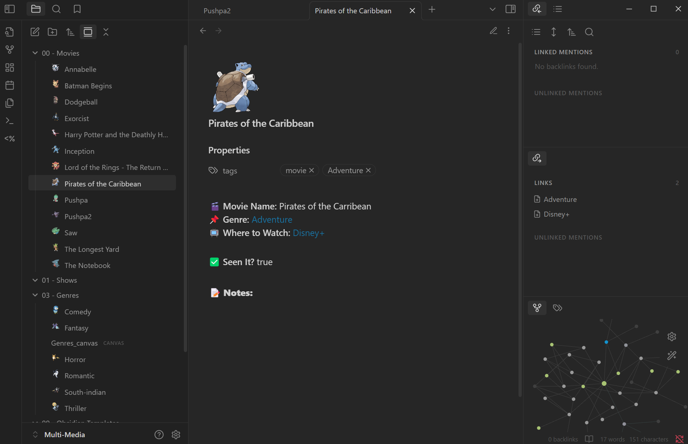
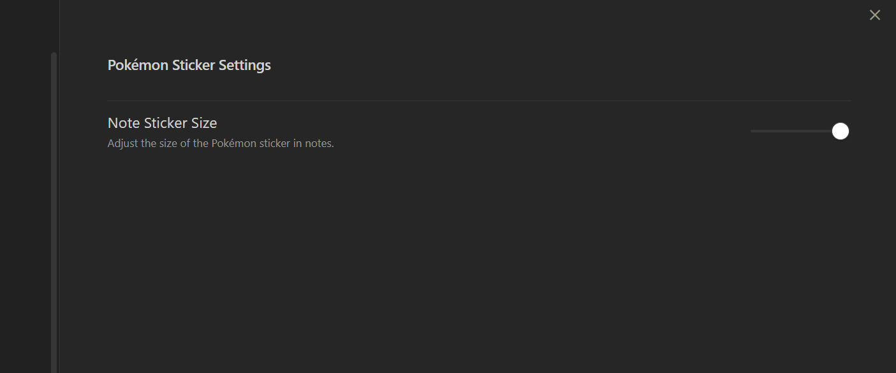
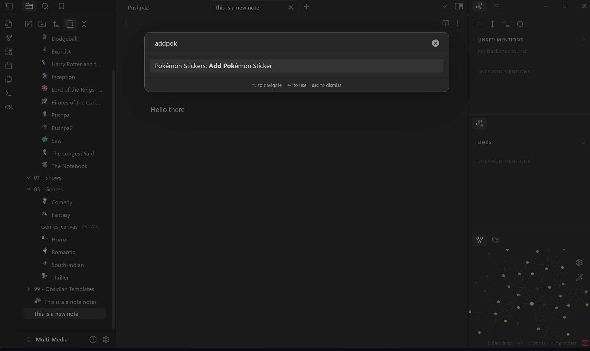
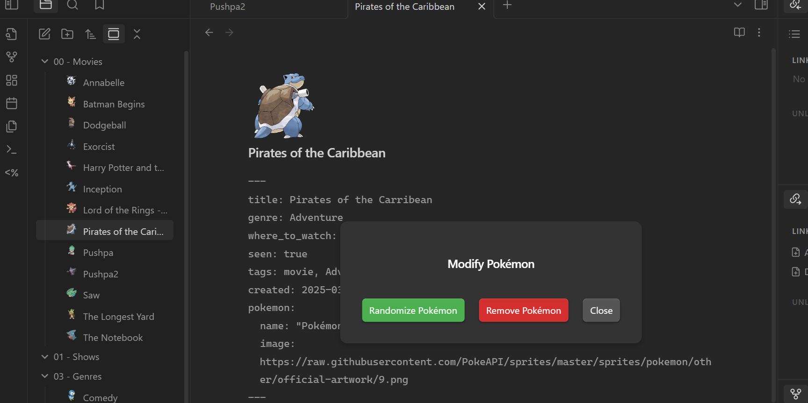

# Pokémon Sticker Plugin 🎉

## 📝 What is this?

This Obsidian plugin allows you to add **random Pokémon stickers** to your notes! 🎮

## 🤷‍♂️ Why?

Apps like Notion allow you to add emojis or other stickers to your notes

Pokémon stickers add a fun and visually engaging element to notes, which can help people with ADHD stay interested and focused.

Colorful and familiar visuals can make an otherwise plain workspace feel less overwhelming and more inviting.

This is a fun way to add some color and style!

Super light weight and easy to use!

## 🚀 Features:

✅ Assigns a **random Pokémon** to a note.  
✅ **Click the sticker** to change it or remove it.  
✅ **File Explorer stickers** for easy visual organization.  
✅ **Adjust sticker size** in settings!  
✅ **Smooth animations & lightweight performance**.

## 📦 Installation:

1. Download & extract this repository into `YOUR_OBSIDIAN_VAULT/.obsidian/plugins/pokemon-sticker-plugin`.
2. Enable the plugin in **Obsidian Settings > Community Plugins**.

## 🛠️ Plugin Settings:

- Adjust **Pokémon sticker size** inside your notes.

## 📷 Preview:

## 💡 Future Updates:

- Add custom Pokémon selection from a full Pokédex.
- Allow multiple Pokémon per note!

## 🛑 Disclaimer

This project uses the [PokéAPI](https://pokeapi.co/), an open-source Pokémon API.

Pokémon and all associated names, images, and assets are trademarks of **Nintendo, Game Freak, and The Pokémon Company International**. This project is **not affiliated, endorsed, or sponsored** by any of these entities.

All Pokémon images used in this plugin come from [PokéAPI’s official artwork sprites](https://raw.githubusercontent.com/PokeAPI/sprites/master/sprites/pokemon/other/official-artwork/).

This project is intended for **educational and personal use only**. Please respect Nintendo and Game Freak’s intellectual property rights.

---

🌟 **Enjoy your Pokémon stickers in Obsidian!**  
Made with ❤️ by [Faheem Siddiqui](https://github.com/faheemsidd15)

---

⭐ Enjoying this plugin? Please consider starring the repository on GitHub:  
👉 https://github.com/faheemsidd15/pokemon-stickers-obsidian

